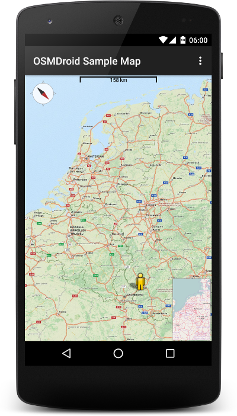

[](https://travis-ci.org/osmdroid/osmdroid)
[](https://maven-badges.herokuapp.com/maven-central/org.osmdroid/osmdroid-android)

# osmdroid

osmdroid is a (almost) full/free replacement for Android's MapView (v1 API) class. It also includes a modular tile provider system with support for numerous online and offline tile sources and overlay support with built-in overlays for plotting icons, tracking location, and drawing shapes.

Current Release: **5.2 April 28th, 2016**

Please read the [osmdroid wiki](https://github.com/osmdroid/osmdroid/wiki) for  tutorials on integration.

**Gradle dependency**
```groovy
repositories {
        mavenCentral()
}

dependencies {
    compile 'org.osmdroid:osmdroid-android:5.2@aar'
    //Note as of 5.0, SLF4j is no longer needed!  compile 'org.slf4j:slf4j-simple:1.6.1'
}
```

**Maven dependency**
```xml
<dependency>
  <groupId>org.osmdroid</groupId>
  <artifactId>osmdroid-android</artifactId>
  <version>5.2</version>
  <type>aar</type>
</dependency>
```

You can also [compile osmdroid from source](https://github.com/osmdroid/osmdroid/wiki/How-to-build-osmdroid-from-source) or [download the dependency directly from OSS](https://oss.sonatype.org/content/groups/public/org/osmdroid/osmdroid-android/) or [download the distribution package](https://github.com/osmdroid/osmdroid/releases)

## OK now what?
Continue reading here, [How-to-use-the-osmdroid-library](https://github.com/osmdroid/osmdroid/wiki/How-to-use-the-osmdroid-library)

Related and **important** wiki articles
 * [Change Log](https://github.com/osmdroid/osmdroid/wiki/Changelog)
 * [FAQ](https://github.com/osmdroid/osmdroid/wiki/FAQ)
 * [Important notes on using osmdroid in your app](https://github.com/osmdroid/osmdroid/wiki/Important-notes-on-using-osmdroid-in-your-app)
 * [Upgrade guide](https://github.com/osmdroid/osmdroid/wiki/Upgrade-Guide)

## I have a question or want to report a bug

If you have a question, please view the [osmdroid FAQ](https://github.com/osmdroid/osmdroid/wiki/FAQ).  
You can also view the [Stack Overflow osmdroid tag](http://stackoverflow.com/questions/tagged/osmdroid) and [osmdroid Google Group](https://groups.google.com/forum/#!forum/osmdroid) where you can get feedback from a large pool of osmdroid users.

If you still have an issue, please check the [Changelog](https://github.com/osmdroid/osmdroid/wiki/Changelog) page to see if this issue is fixed in a newer or upcoming version of osmdroid.

If think you have a legitimate bug to report then go to the [Issues](https://github.com/osmdroid/osmdroid/issues?state=open) page to see if your issue has been reported. If your issue already exists then please contribute information that will help us track down the source of the issue. If your issue does not exist then create a new issue report. When creating an issue, please include the version of osmdroid, the Android platform target and test device you are using, and a detailed description of the problem with relevant code. It is particularly helpful if you can reproduce the problem using our [OpenStreetMapViewer](https://github.com/osmdroid/osmdroid/tree/master/OpenStreetMapViewer) sample project as your starting point.

## I want to contribute

Great! Osmdroid continues to improve from the contributions of its users. This could include code contributions, sample fragments for [OpenStreetMapViewer](https://github.com/osmdroid/osmdroid/tree/master/OpenStreetMapViewer), or wiki content.
If you have an enhancement to contribute please add a new issue.
Describe the enhancement you are adding, how you implemented it and attach a patch against the latest trunk.
Please take a look at the [Developer Guidelines](https://github.com/osmdroid/osmdroid/wiki/Developer-Guidelines) page for code contributions before submitting code.

## I want more!

The [OSMBonusPack project](https://github.com/MKergall/osmbonuspack) adds additional functionality for use with osmdroid projects.

## Screenshots




## Building from source and using the aar in your app
Thanks to <a href="https://github.com/chrisdoyle/gradle-fury">Gradle Fury</a>, this publishes the artifacts to mavenLocal.

```
./gradlew clean install
```

In your root `build.gradle` file, add mavenLocal() if not present.
```
allprojects {
    repositories {
            mavenCentral()
            mavenLocal()    //add this if it's missing
    }
}

```

Then in your APK or AAR project that needs osmdroid. Future readers: you may have to update the version numbers to match the source. Hint: the version number is defined in osmdroid gradle.properties file, key = pom.version.

```
    compile 'org.osmdroid:osmdroid-android:5.3-SNAPSHOT:debug@aar'
```


## Running tests on a device (hardware or virtual)
```
./gradlew cC
```

## Prepare distribution

```
./gradlew clean install distZip distro -Pprofile=sources,javadocs
```

Output zip is at osmdroid-dist/build/distributions/

## Publish release artifacts
Edit gradle.properties and update the version information (android.versionCode and pom.version). Commit the change and tag with git.

Edit gradle.properties and set your credentials for nexus endpoint to publish to
```
./gradlew clean install distZip distro -Pprofile=sources,javadocs publish
```
Edit gradle.properties and remove your crendentials.
